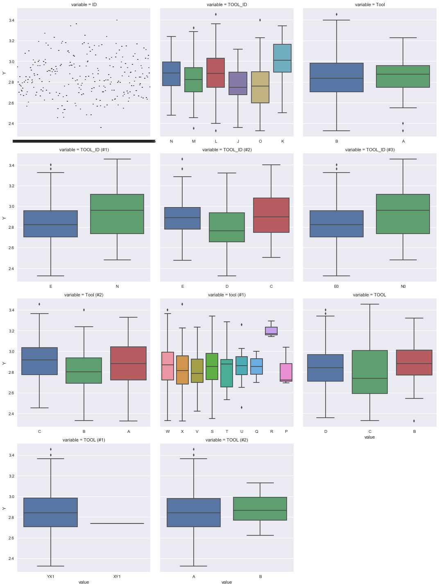
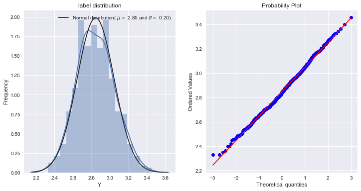

# Init


```python
import pandas as pd
import numpy as np
import matplotlib.pyplot as plt
import seaborn as sns
%matplotlib inline
from sklearn.linear_model import ElasticNet, Lasso, BayesianRidge, LassoLarsIC
from sklearn.svm import SVR
from sklearn.ensemble import RandomForestRegressor, GradientBoostingRegressor
from sklearn.kernel_ridge import KernelRidge
from sklearn.pipeline import make_pipeline
from sklearn.preprocessing import RobustScaler,StandardScaler
from sklearn.model_selection import KFold,cross_val_score,train_test_split,StratifiedShuffleSplit
from sklearn.metrics import mean_squared_error
from sklearn.model_selection import GridSearchCV
from sklearn.base import BaseEstimator, TransformerMixin, RegressorMixin, ClassifierMixin, clone
import xgboost as xgb
import lightgbm as lgb
import warnings
def ignore_warn(*args,**kwargs):
    pass
warnings.warn = ignore_warn

filepath = "F:\\Python_data_set\\tianchi\\smicon\\"
train = pd.read_csv(filepath+"train.csv")
testA = pd.read_csv(filepath+"testA.csv")
testB = pd.read_csv(filepath+"testB.csv")
```

filepath = "F:\\Python_data_set\\tianchi\\smicon\\"
train = pd.read_excel(filepath+"ѵÁ·.xlsx")
testA = pd.read_excel(filepath+"²âÊÔA.xlsx")
testB = pd.read_excel(filepath+"²âÊÔB.xlsx")
train.to_csv(filepath+"train.csv",index=False)
testA.to_csv(filepath+"testA.csv",index=False)
testB.to_csv(filepath+"testB.csv",index=False)

# functions


```python
def category_plot(train):
    category_col = train.dtypes[train.dtypes==object].index
    for c in category_col:
        train[c] = train[c].fillna("Missing")
    def boxplot(x,y,**kwargs):
        sns.boxplot(x=x,y=y)    
    f = pd.melt(train,id_vars=train.columns[-1],value_vars=category_col)
    g = sns.FacetGrid(f,col='variable',col_wrap=3,sharex=False,sharey=True,size=5)
    g = g.map(boxplot,'value',train.columns[-1])
    
def numeric_plot(train):
    numeric_col = train.drop(train.columns[-1],axis=1).dtypes[train.dtypes!=object].index
    for c in numeric_col:
        train[c] = train[c].dropna()
        sns.jointplot(x=c,y=train.columns[-1],data =train,kind='reg')
    plt.figure(figsize=(12,12))
    sns.heatmap(train.corr(),vmax=0.9,square=True)
        
from scipy.stats import norm,probplot
def label_distribution(label):
    plt.figure(figsize=(12,6))
    plt.subplot(121)
    sns.distplot(label,fit=norm)
    (mu,sigma) = norm.fit(label)
    plt.legend(["Normal distribution( $\mu=$ {:.2f} and $\sigma=$ {:.2f})"
                .format(mu, sigma)],loc='best')
    plt.ylabel('Frequency')
    plt.title('label distribution')
    plt.subplot(122)
    qqplot = probplot(label,plot=plt)

def drop_all_null(df,train):
    drop_index = train.isnull().sum()[train.isnull().sum()==train.shape[0]].index
    print('\nall_null num: {}'.format(len(drop_index)))
    df.drop(drop_index,axis=1,inplace=True)
    return df

def drop_unique_col(df,train,percent=0.01):
# percent: least percent of different values accounted for all
    drop_index = []
    for c in df:
        if train[c].value_counts().values[1:].sum()<train.shape[0]*percent:
            drop_index.append(c)
    print('\nunique_value_col num: {}'.format(len(drop_index)))
    df.drop(drop_index,axis=1,inplace=True)
    return df

def low_corr(train):
    corr = []
    numeric_col = train.drop(train.columns[-1],axis=1).dtypes[train.dtypes!=object].index
    for c in numeric_col:
        corr.append(abs(np.corrcoef(train[c].values,train.iloc[:,-1].values)[1,0]))
    corr_df = pd.DataFrame({'col':numeric_col,'corr':corr})
    low_corr = corr_df.loc[corr_df['corr']< 0.2].set_index('col').index
    print('\nlow_corr num: {}\nthey are: {}'.format(len(low_corr),low_corr))
    return low_corr

def detect_outlier(train,n):
# n: instance beyond n cols possess outliers will be detect
    outlier_ind = []
    numeric_col = train.drop(train.columns[-1],axis=1).dtypes[train.dtypes!=object].index
    for col in numeric_col:
        Q1 = np.percentile(train[col],25)
        Q3 = np.percentile(train[col],75)
        IQR = Q3 - Q1
        outlier_ind.extend(train[(train[col]<(Q1-1.5*IQR))|(train[col]>(Q3+1.5*IQR))].index)
    outlier_count = pd.Series(outlier_ind).value_counts()
    outlier_drop = outlier_count[outlier_count.values>n].index
    print('\noutlier instances has: {}'.format(len(outlier_drop)))
    return outlier_drop

from sklearn.decomposition import PCA
def pca_specif(df,pca_col,non_pca_col):    
    pca = PCA(n_components=0.99)
    df_pca_temp = pd.DataFrame(pca.fit_transform(df[pca_col]))
    df_pca = pd.concat([df_pca_temp,df[non_pca_col]],axis=1).reset_index(drop=True)
    print('\nPCA decompose to {} dim and its explained_variance_ratio_ = {}'
          .format(df_pca_temp.shape[1],pca.explained_variance_ratio_))
    print('\nAfter PCA, we have {} columns'.format(df_pca.shape[1]))
    return df_pca

from scipy.stats import skew
from scipy.special import boxcox1p
def skew_numeric(df,skew_limit = 0.75,lam = 0.15):
    numeric_col = df.dtypes[df.dtypes != "object"].index
    skewed_col = df[numeric_col].apply(lambda x: skew(x.dropna()))
    skewed_col = skewed_col[abs(skewed_feats) > skew_limit].index
    df[skewed_feats] = boxcox1p(abs(df[skewed_feats]),lam)
    print('\nboxcox1p num: {}'.format(skewed_col.size))
    print('\n they are: {}'.format(skewed_col))
    return df

from sklearn.preprocessing import RobustScaler,StandardScaler
def dummy_split_scale(df,y,split,scale=0):
    print("\nBefore dummy, features contains: {}".format(df.shape))
    category_col = df.dtypes[df.dtypes==object].index
    print(category_col)
    df = pd.get_dummies(df,columns=category_col)
    print("\nAfter dummy, features contains: {}".format(df.shape))
    train_x = df[:split]
    test_x  = df[split:]
    y  = y.values
    ss = (RobustScaler()) if (scale==0) else (StandardScaler())
    ss.fit(train_x)
    train_x_s = ss.transform(train_x)
    test_x_s = ss.transform(test_x)
    return train_x_s,test_x_s,y,train_x.columns

from sklearn.model_selection import KFold,cross_val_score,train_test_split,StratifiedShuffleSplit
def cross_val(model,method,train_x, y,n_folds=5):
# method: 'class', 'regg'
    if method=='class':
        CV = StratifiedShuffleSplit(n_splits=n_folds,test_size = 1/n_folds,random_state=42)
        accuarcy = cross_val_score(model, train_x, y, scoring="accuracy",cv = CV)
        return accuarcy
    elif method=='regg':
        CV = KFold(n_folds, shuffle=True, random_state=42).get_n_splits(train_x)
        rmse= np.sqrt(-cross_val_score(model, train_x, y, scoring="neg_mean_squared_error", cv = CV))
        return rmse
    
from sklearn.metrics import mean_squared_error
from sklearn.model_selection import GridSearchCV
def param_select(model,param,method,train_x, y,n_folds=5):
# method: 'class', 'regg'
    if method=='class':
        CV = StratifiedShuffleSplit(n_splits=n_folds,test_size = 1/n_folds,random_state=42)        
        models = GridSearchCV(model,param,scoring="accuracy",cv=CV)
    elif method=='regg':
        CV = KFold(n_folds, shuffle=True, random_state=42).get_n_splits(train_x)
        models = GridSearchCV(model,param,scoring="neg_mean_squared_error",cv=CV)
    models.fit(train_x,y)
    return models.best_estimator_,models.best_params_

def model_feats_importance(coef,final_col,n=5):
    importance = pd.DataFrame({"columns":list(final_col), "coef":list(coef.T)})
    god_feats_temp = abs(importance['coef']).sort_values(ascending=False).index[:n]
    ash_feats_temp = importance.loc[np.abs(importance.coef) <= 1e-6]
    god_feats = importance.iloc[god_feats_temp,:]
    ash_feats = ash_feats_temp.loc[[a.find("_")==-1 for a in importance["columns"]]]
    print('god feats:\n {}'.format(god_feats))
    print('ash feats:\n {}'.format(ash_feats)) 
```

# Data Exploration


```python
#print(train.head())
#print(testA.head())
#print(testB.head())
#print(train.describe())
print("train contains: {}".format(train.shape))
print("testA contains: {}".format(testA.shape))
print("testB contains: {}".format(testB.shape))

numeric_feats = train.drop("Y",axis=1).dtypes[train.dtypes != object].index
category_feats = train.dtypes[train.dtypes == object].index

features = pd.concat([train,testA,testB]).reset_index(drop=True)
features.drop("Y",axis=1,inplace=True)
train_label = train["Y"]
print("features contains: {}".format(features.shape))

print("\nnumeric features num: {}\nnumeric features are: {}"
      .format(numeric_feats.size,numeric_feats))      
print("\ncategorical features num: {}\ncategorical features are: {}"
      .format(category_feats.size,category_feats))     
```

    train contains: (500, 8029)
    testA contains: (100, 8028)
    testB contains: (121, 8028)
    features contains: (721, 8028)
    
    numeric features num: 8017
    numeric features are: Index(['210X1', '210X2', '210X3', '210X4', '210X5', '210X6', '210X7', '210X8',
           '210X9', '210X10',
           ...
           '750X1443', '750X1444', '750X1445', '750X1446', '750X1447', '750X1448',
           '750X1449', '750X1450', '750X1451', '750X1452'],
          dtype='object', length=8017)
    
    categorical features num: 11
    categorical features are: Index(['ID', 'TOOL_ID', 'Tool', 'TOOL_ID (#1)', 'TOOL_ID (#2)', 'TOOL_ID (#3)',
           'Tool (#2)', 'tool (#1)', 'TOOL', 'TOOL (#1)', 'TOOL (#2)'],
          dtype='object')
    

## numeric features distribution

Too much features so that I decided to delete features that has low correlation with y

Then PCA the rest, data exploration will be done after PCA.

del_col = low_corr(train.drop(['Tool (#1)','Tool (#3)','tool'],axis=1))

features.drop(del_col,axis=1,inplace=True)

## categorical features distribution


```python
category_plot(train)
```





## label distribution


```python
label_distribution(train_label)
```





# Data preprocessing

## outlier

detect outlier 


```python
outlier_drop =  detect_outlier(train,350)
```

    
    outlier instances has: 143
    

delete outlier


```python
train = train.drop(outlier_drop,axis=0).reset_index(drop=True)
features = pd.concat([train,testA,testB]).reset_index(drop=True)
features.drop("Y",axis=1,inplace=True)
train_label = train["Y"]
```

## missing value 


```python
features = drop_all_null(features,train)
features.isnull().sum()[features.isnull().sum()>1].sort_values(ascending=False)
```

    
    all_null num: 62
    


    311X28     329
    312X628    300
    312X532    300
    312X5      300
    312X50     300
    312X502    300
    312X508    300
    312X514    300
    312X520    300
    312X526    300
    312X538    300
    312X484    300
    312X544    300
    312X55     300
    312X550    300
    312X556    300
    312X562    300
    312X568    300
    312X574    300
    312X580    300
    312X490    300
    312X478    300
    312X592    300
    312X413    300
    312X371    300
    312X377    300
    312X383    300
    312X389    300
    312X395    300
    312X40     300
              ... 
    420X213      3
    420X212      3
    420X211      3
    420X210      3
    420X21       3
    420X209      3
    420X208      3
    420X207      3
    420X206      3
    420X205      3
    420X226      3
    420X228      3
    420X40       3
    420X229      3
    420X4        3
    420X39       3
    420X38       3
    420X37       3
    420X36       3
    420X35       3
    420X34       3
    420X33       3
    420X32       3
    420X31       3
    420X30       3
    420X3        3
    420X29       3
    420X230      3
    420X23       3
    420X69       3
    Length: 2636, dtype: int64


features with small amount null set to median 


```python
#large_null = features.isnull().sum()[features.isnull().sum()>500].index
#features.drop(large_null,axis=1,inplace=True)
features = features.fillna(features.median())
```

## delete features

delete date


```python
numeric_feats = features.dtypes[features.dtypes != object].index
ind = []
for c in numeric_feats:
    if abs(features[c][0]) >= 1e15:  
        ind.append(c)
print(ind)
features.drop(ind,axis=1,inplace=True)
```

    ['220X67', '220X71', '220X75', '220X79', '220X83', '220X87', '220X91', '220X95', '310X56', '310X60', '310X64', '310X68', '310X72', '310X76', '310X80', '310X84']
    

delete id and unique value col


```python
features.drop('ID',axis=1,inplace=True)
features = drop_unique_col(features,train,percent=0.01)
```

    
    unique_value_col num: 1189
    

# Feature Engineering

## num2category


```python
features['Tool (#1)'] = features['Tool (#1)'].astype(str)
features['Tool (#3)'] = features['Tool (#3)'].astype(str)
features['tool'] = features['tool'].astype(str)
print(features.shape)
```

    (578, 6760)
    

## pca & numeric exploaration

remaining 99% of info of the raw data

partial pca wpt production sequence


```python
col_name = pd.Series(list(features.columns))

from sklearn.decomposition import PCA    
pca = PCA(n_components=0.99)
# distingish features NOT included in production sequence
Temp = []
for col in col_name:
    if str.find(col,'X') == -1:
            Temp.append(col)
print('Not in Seq: {}'.format(Temp))   

# extract Seq name
Seq_col = col_name.str.extract("(\w+)X")
print('\nDouble check, number of features not in seq is {}'.format(Seq_col.isnull().sum()))
Seq_col.fillna('Missing',inplace=True)
# unique set
Seq = set(Seq_col)
Seq.remove('Missing')
print('\nProduction Seqs have:{}'.format(Seq))
```

    Not in Seq: ['TOOL', 'TOOL_ID', 'TOOL_ID (#1)', 'TOOL_ID (#2)', 'TOOL_ID (#3)', 'Tool', 'Tool (#1)', 'Tool (#2)', 'Tool (#3)', 'tool', 'tool (#1)']
    
    Double check, number of features not in seq is 11
    
    Production Seqs have:{'261', '210', '312', '520', '344', '400', '340', '440A', '330', '310', '220', '360', '420', '300', '750', '311'}
    


```python
temp = []
features_pca = features[Temp]
for seq in Seq:
    for col in col_name:
         if str.find(col,seq+'X') != -1:
            temp.append(col)
    # pca
    Seq_pca = pd.DataFrame(pca.fit_transform(features[temp]))
    # rename the dataframe
    Seq_pca.rename(columns = lambda x:seq+'v'+str(x),inplace=True)
    # info
    print('Seq{} has {} dim and its explained_variance_ratio_ = {}'.format(seq,Seq_pca.shape[1],pca.explained_variance_ratio_))
    # reunion
    features_pca = pd.concat([features_pca,Seq_pca],axis=1).reset_index(drop=True)
print('\nAfter PCA, we have {} columns'.format(features_pca.shape[1]))
```

    Seq261 has 1 dim and its explained_variance_ratio_ = [ 0.99999974]
    Seq210 has 2 dim and its explained_variance_ratio_ = [ 0.92834539  0.06472026]
    Seq312 has 2 dim and its explained_variance_ratio_ = [ 0.92834539  0.06472026]
    Seq520 has 2 dim and its explained_variance_ratio_ = [ 0.9279368   0.06470892]
    Seq344 has 2 dim and its explained_variance_ratio_ = [ 0.9279368   0.06470892]
    Seq400 has 2 dim and its explained_variance_ratio_ = [ 0.9276057   0.06469123]
    Seq340 has 2 dim and its explained_variance_ratio_ = [ 0.9276057   0.06469123]
    Seq440A has 2 dim and its explained_variance_ratio_ = [ 0.9276057   0.06469123]
    Seq330 has 1 dim and its explained_variance_ratio_ = [ 0.99999999]
    Seq310 has 1 dim and its explained_variance_ratio_ = [ 0.99999999]
    Seq220 has 1 dim and its explained_variance_ratio_ = [ 0.99999999]
    Seq360 has 1 dim and its explained_variance_ratio_ = [ 0.99999999]
    Seq420 has 1 dim and its explained_variance_ratio_ = [ 0.99999999]
    Seq300 has 1 dim and its explained_variance_ratio_ = [ 0.99999999]
    Seq750 has 1 dim and its explained_variance_ratio_ = [ 0.99999999]
    Seq311 has 1 dim and its explained_variance_ratio_ = [ 0.99999999]
    
    After PCA, we have 34 columns
    

pca whole again


```python
numeric_feats = features_pca.dtypes[features_pca.dtypes != object].index
category_feats = features_pca.dtypes[features_pca.dtypes == object].index
features_pca = pca_specif(features_pca,numeric_feats,category_feats)
```

    
    PCA decompose to 1 dim and its explained_variance_ratio_ = [ 0.99999999]
    
    After PCA, we have 12 columns
    

## dummy split scale


```python
train_label = train["Y"]
train_x,test_x,y,final_col = dummy_split_scale(features_pca,train_label,train.shape[0],scale=1)
```

    
    Before dummy, features contains: (578, 12)
    Index(['TOOL', 'TOOL_ID', 'TOOL_ID (#1)', 'TOOL_ID (#2)', 'TOOL_ID (#3)',
           'Tool', 'Tool (#1)', 'Tool (#2)', 'Tool (#3)', 'tool', 'tool (#1)'],
          dtype='object')
    
    After dummy, features contains: (578, 58)
    

# Modelling


```python
param = {"alpha": np.logspace(-5,0,100).round(5)}
lasso,best_param = param_select(Lasso(),param,'regg',train_x, y,n_folds=5)
print("Lasso: {}".format(best_param))

param = {"alpha": np.logspace(-5,0,100).round(5),"l1_ratio":np.linspace(0.1,0.9,18)}
ENet,best_param = param_select(ElasticNet(random_state=1),param,'regg',train_x, y,n_folds=5)
print("ENet: {}".format(best_param))

param = {"alpha": np.logspace(-3,0,50).round(5),"gamma": np.logspace(-3,0,50).round(5),"coef0":np.linspace(-5,5,20)}
KRR,best_param = param_select(KernelRidge( kernel='rbf'),param,'regg',train_x, y,n_folds=5)
print("KRR: {}".format(best_param))

param = {"C": np.logspace(-5,0,100).round(5)}
svr,best_param = param_select(SVR(),param,'regg',train_x, y,n_folds=5)
print(best_param)

param = {"n_estimators":range(10,200,100), "min_samples_split":range(2,10,5),
         "min_samples_leaf":range(1,5,5), "max_depth":range(1,6,5)}
rfr,best_param = param_select(RandomForestRegressor(random_state=3),param,'regg',train_x, y,n_folds=5)
print("RFR: {}".format(best_param))

param = {"colsample_bytree": np.linspace(0.2,1,5), "gamma": np.logspace(-2,1,5),
         "learning_rate": np.logspace(-2,0,5), "max_depth": range(3,11,8),
         "n_estimators": range(10,200,50), "subsample": np.linspace(0.2,1,5)}
XGB,best_param = param_select(xgb.XGBRegressor(random_state=4),param,'regg',train_x, y,n_folds=5)
print("XGB: {}".format(best_param))

param = {"learning_rate": np.logspace(-2,0,5),"n_estimators":range(10,200,100),
         "colsample_bytree": np.linspace(0.2,1,5), "subsample": np.linspace(0.2,1,5),
         "min_split_gain": np.logspace(-2,0,5), "max_depth":range(1,5,5)}
LGB,best_param = param_select(lgb.LGBMRegressor(),param,'regg',train_x, y,n_folds=5)
print("LGB: {}".format(best_param))
```

    Lasso: {'alpha': 0.0042300000000000003}
    ENet: {'alpha': 0.04863, 'l1_ratio': 0.10000000000000001}
    KRR: {'alpha': 0.21210000000000001, 'coef0': 5.0, 'gamma': 0.001}
    {'C': 0.10975}
    RFR: {'max_depth': 1, 'min_samples_leaf': 1, 'min_samples_split': 2, 'n_estimators': 110}
    XGB: {'colsample_bytree': 1.0, 'gamma': 0.056234132519034911, 'learning_rate': 0.10000000000000001, 'max_depth': 3, 'n_estimators': 60, 'subsample': 0.80000000000000004}
    LGB: {'colsample_bytree': 0.60000000000000009, 'learning_rate': 0.10000000000000001, 'max_depth': 1, 'min_split_gain': 0.031622776601683791, 'n_estimators': 110, 'subsample': 0.40000000000000002}
    

lasso = Lasso(alpha=0.00534)
ENet = ElasticNet(alpha=0.04863,l1_ratio=0.1,random_state=1)
KRR = KernelRidge(alpha= 0.1842,degree=1.0,coef0=-2.8947)
svr = SVR(C =0.01205)
rfr = RandomForestRegressor(n_estimators=110, min_samples_split=2, 
                            min_samples_leaf=1, max_depth=1, random_state=3)
XGB = xgb.XGBRegressor(colsample_bytree=0.4, gamma=0.056, 
                       learning_rate= 0.1, max_depth=3, 
                       n_estimators=110,subsample=0.6, random_state=4)
LGB = lgb.LGBMRegressor(colsample_bytree= 0.2, learning_rate= 1,
                        max_depth= 1, min_split_gain= 0.01,
                        n_estimators=10,subsample=0.6)

feature importance

print('lasso')
model_feats_importance(lasso.coef_,final_col,10)
print('\nENet')
#model_feats_importance(ENet.coef_,final_col,10)
print('\nXGB')
model_feats_importance(XGB.feature_importances_,final_col,10)
print('\nLGB')
model_feats_importance(LGB.feature_importances_,final_col,10)

## scores


```python
score = cross_val(lasso,'regg',train_x, y,n_folds=5)
print("Lasso score: {:.4f} +/- {:.4f}".format(score.mean(), score.std()))
score = cross_val(ENet,'regg',train_x, y,n_folds=5)
print("ENet score: {:.4f} +/- {:.4f}".format(score.mean(), score.std()))
score = cross_val(KRR,'regg',train_x, y,n_folds=5)
print("KRR score: {:.4f} +/- {:.4f}".format(score.mean(), score.std()))
score = cross_val(svr,'regg',train_x, y,n_folds=5)
print("SVR score: {:.4f} +/- {:.4f}".format(score.mean(), score.std()))
score = cross_val(rfr,'regg',train_x, y,n_folds=5)
print("RFR score: {:.4f} +/- {:.4f}".format(score.mean(), score.std()))
score = cross_val(XGB,'regg',train_x, y,n_folds=5)
print("XGB score: {:.4f} +/- {:.4f}".format(score.mean(), score.std()))
score = cross_val(LGB,'regg',train_x, y,n_folds=5)
print("LGB score: {:.4f} +/- {:.4f}".format(score.mean(), score.std()))
```

    Lasso score: 0.1865 +/- 0.0139
    ENet score: 0.1860 +/- 0.0145
    KRR score: 0.1872 +/- 0.0164
    SVR score: 0.1861 +/- 0.0182
    RFR score: 0.1956 +/- 0.0223
    XGB score: 0.1807 +/- 0.0155
    LGB score: 0.1820 +/- 0.0165
    


```python
from sklearn.base import BaseEstimator, TransformerMixin, RegressorMixin, clone
class StuckingModels(BaseEstimator, RegressorMixin, TransformerMixin):
    def __init__(self,BaseModels,MetaModel):
        self.BaseModels = BaseModels
        self.MetaModel  = MetaModel
        
    def fit(self,x_data,y_data):
        self.BaseModels_ = [list() for x in self.BaseModels]
        self.MetaModel_  = clone(self.MetaModel)
        cv = KFold(n_splits= 5, shuffle= True, random_state= 10)
        meta_fold = np.zeros((x_data.shape[0],len(self.BaseModels)))
        
        for i,model in enumerate(self.BaseModels):
            for train_index, test_index in cv.split(x_data,y_data):
                instance = clone(model)
                self.BaseModels_[i].append(instance)
                instance.fit(x_data[train_index],y_data[train_index])
                pred = instance.predict(x_data[test_index])
                meta_fold[test_index, i] = pred
                
        self.MetaModel_.fit(meta_fold,y_data) 
        return self
    
    def predict(self,x_data):
        meta_features = np.column_stack([
            np.column_stack([model.predict(x_data) for model in BaseModels]).mean(axis=1)
            for BaseModels in self.BaseModels_])
        return self.MetaModel_.predict(meta_features)
```


```python
StuckedModels =StuckingModels(BaseModels=(ENet,svr,LGB,XGB,rfr),MetaModel=lasso)
score = cross_val(StuckedModels,'regg',train_x, y,n_folds=5)
print("\nStucked base models score:{:.4f} +/- {:.4f}".format(score.mean(),score.std()))
```

    
    Stucked base models score:0.1885 +/- 0.0171
    

# Prediction


```python
StuckedModels.fit(train_x,y)
predict = StuckedModels.predict(test_x)

submission = pd.DataFrame({"ID":testA.ID,"Y":predict[:testA.shape[0]]})
submission.to_csv(filepath + "²âÊÔA-´ð°¸Ä£°å.csv",index=False)
submission = pd.DataFrame({"ID":testB.ID,"Y":predict[testA.shape[0]:]})
submission.to_csv(filepath + "²âÊÔB-´ð°¸Ä£°å.csv",index=False)
```


```python

```
